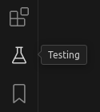

# Agora hands on

Workshop on PyTest and Streamlit!

_Software Agora - 12.06.2025_

## Set Up

1. Create your environment

    `python3 -m venv .venv`

2. Activate it

    `source .venv/bin/activate`

3. Install the requirements

    `pip install -r requirements.txt`

4. On VSCode:
   1. Do `ctrl+shift+p`
   2. Click on `Python: Select Interpreter`
   3. Select the new created `.venv`

5. Set up the test environment
   1. Go the the test icon in the left sidebar

        
   2. Select `Configure Python Test`
   3. Select `PyTest` and our new `.venv` interpreter

### Ready to go! 🧬🧬🧬